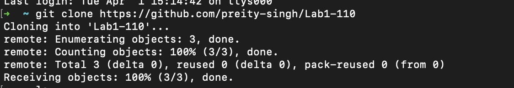
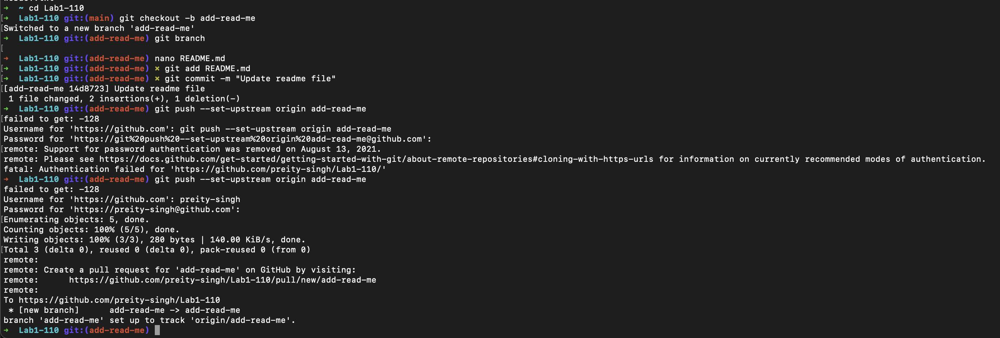
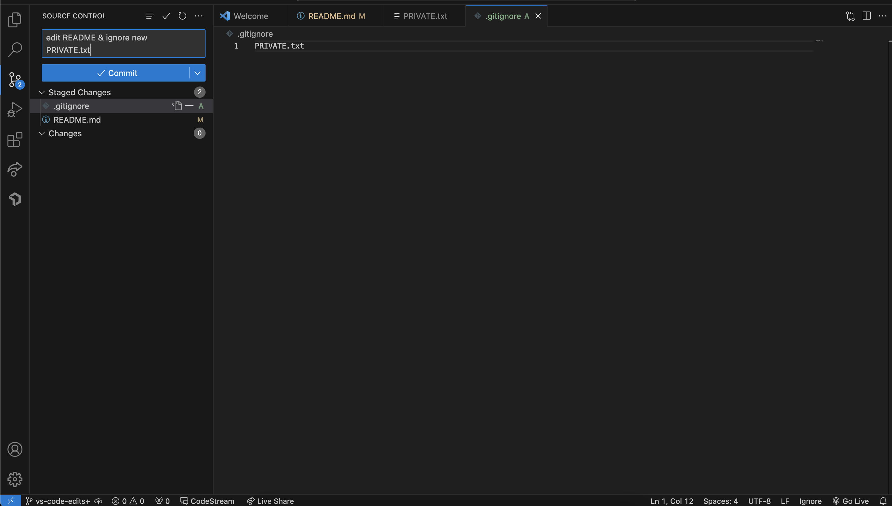

# Preity's User Page

Hello! Welcome to my page!

## Table of Contents
- [About Me](#a-little-about-me)
- [Classes I'm Taking](#my-spring-quarter)
- [My Interests](#what-im-interested-in)
- - [Screenshots from Lab](#screenshots)
[View the README](./README.md)

## A Little About Me
- I'm a second year **computer science** student at [UC San Diego](https://ucsd.edu). 
- I'm from **Denver**, Colorado.
- I like reading, skiing, hiking, and F1.
  
## My Spring Quarter
[x] CSE 110
[] MATH 183
[] COGS 108
[] POLI 28

## What I'm interested in
- Human-AI Interaction
- Machine Learning
- Web Development
- App Development
  
## Languages (Ranked)
1. Java
2. Python
3. C++
4. C (booooo)
  
## Some quotes I like 
- > "The mountains are calling, and I must go!" - John Muir 
- > "Hard work works hard" - My dad?

## Code Snippet 
<pre> <code> 
java public class HelloWorld { 
    public static void main(String[] args) { 
        System.out.println("Hello, world!"); 
    }
} ``` </code> </pre>

## Screenshots
### Git Command Line



### VSCode UI



